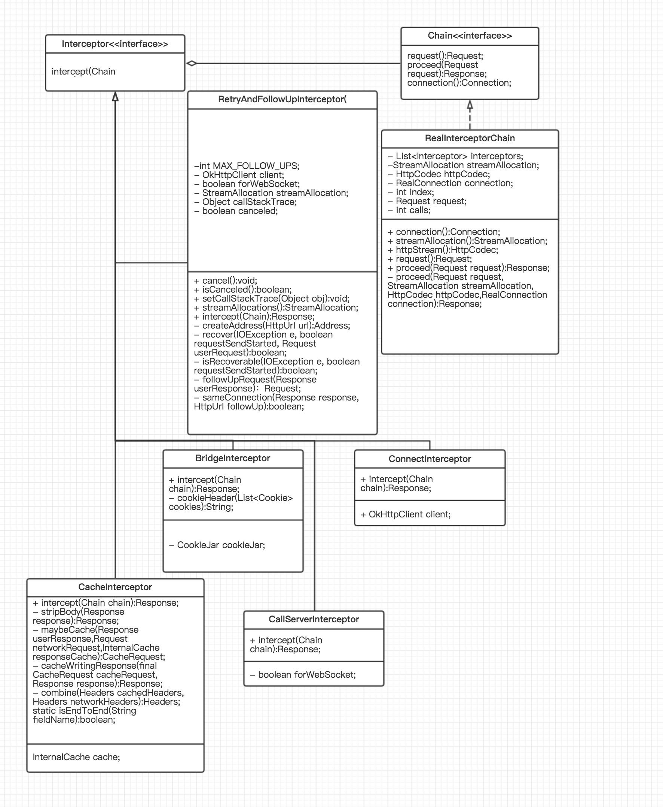

# OkHttp框架阅读

## 目标
+ [ ] 搞懂框架实现的功能，及其核心技术点
+ [ ] 了解框架的设计的核心思想
+ [ ] 学会使用该框架

## 阅读路径
+ 先从用法入手，找出核心类及方法，画出流程图或者用户实例图
+ 然后根据特定功能进行深入阅读


## 源码解析
+ 框架简单用法

```java
OkHttpClient client = new OkHttpClient();
OkHttpClient eagerClient = client.newBulider()
	.readTimeout(500,TimeUnit.MILLISECONDS)
	.build();
Response response = eagerClient.newCall(request).execute();
```

+ OkHttp流程图说明
    	

+ 分析出两个核心类：`OkHttpClient`,`Response`，一个设计模式：`建造者模式`
	+ OkHttpClinet
		+ 类图说明
 
		+ 实现了三个接口——`Cloneable`,`Call.Factory`,`WebSocket.Factory` 
			+ 实现Cloneable接口用于实现clone方法实现快速复制对象
		+ 核心类
			+ Builder：`建造者模式`，用于初始化okhttpClient 【private static final class】
				+ Dispatcher
				+ Proxy
				+ List<Protocol>
				+ List<Interceptor> connectionSpecs
				+ List<Interceptor> networkInterceptors
				+ eventListenerFactory
				+ cookieJar
				+ Cache
				+ SocketFactory
				+ SSLSocketFactory
				+ ConnectionPool
				+ `followRedirects/followSslRedirects=true`
				+ `retryOnConnectionFailure=true`
				+ `connectionTimeout=10`
				+ `readTimeout/writeTimeout=10`
				+ `pingInterval=0` 
			+ Dispather
			+ RealCall
			+ Request
			+ Response:实现`Closeable`接口
				+ code
				+ message
				+ request
				+ body
				+ time[send/receive]
				+ network/cache/priorResponse 
		+ 核心方法
			+ newBuilder()->okhttp.Builder
			+ newCall(Request request)->Call 
			+ newWebSocket(Request request, WebSocketListener listener)->RealWeSocket
	+ RealCall
		+ 类图说明
 
		+ 核心类
			+ Dispatcher：管理任务队列
			+ AsyncCall：final class(内部类)，处理异步请求 
			+ RealInterceptorChain：获取Reponse
			+ Response：请求响应类
		+ 核心方法
			+ execute()->Response: 同步方法，执行请求,` Dispatcher.executed()->getResponseWithInterceptorChain()->Dispatcher.finish()` 
			+ enqueue(CallBack callBack)->void: 异步方法加入队列,`Dispatcher.enqueue(new AsyncCall(callBack))`
			+  getResponseWithInterceptorChain()->Response
				+ List<Interceptor> interceptors
				+ add client.interceptors()  
				+ add retryAndFollowUpInterceptor
				+ add BridgeInterceptor
				+ add CacheInterceptor
				+ add ConnectInterceptor
				+ !isWebsocket add client.networkInterceptors()
				+ add CallServerInterceptor
				+ initial `Interceptor.Chain chain = new RealInterceptorChain(interceptors, null, null, null, 0, originalRequest);`
				+ Interceptor.Chain.proceed(originalRequest)
	+ AsyncCall：RealCall的内部类
		+ 核心成员
			+ Callback responseCallback
				+ onFailure()
				+ onResponse() 
		+ 核心方法
			+ execute()->void: `getResponseWithInterceptorChain() -> responseCallback.onFailure()/responseCallback.onResponse() -> Dispatcher.finish()`    
	+ Dispatcher：管理任务队列
		+ 类图说明
 
		+ 核心类
			+ Interceptor
			+ Interceptor.Chain	  
		+ 核心成员
			+ maxRequests = 64
			+ maxRequestsPerHost = 5
			+ Runnable idleCallback
			+ ExecutorService
			+ Deque<AsyncCall> readyAsyncCalls
			+ Deque<AsyncCall> runningAsyncCalls
			+ Deque<AsyncCall> runningSyncCalls 
		+ 核心方法
			+ executorService()->ExecutorService
			+ setMaxRequests/MaxRequestsPerHost/IdleCallback
			+ getMaxRequests/MaxRequestsPerHost/IdleCallback
			+ queued/runningCalls/CallsCount
			+ executed(RealCall)->void: `runningSyncCalls.add(call);`
			+ enqueue(AsybcCall)->void

			```java
			if (runningAsyncCalls.size() < maxRequests && runningCallsForHost(call) < maxRequestsPerHost) {
				runningAsyncCalls.add(call);
				executorService().execute(call);
			} else {
				readyAsyncCalls.add(call);
			}
    		```
    + RealInterceptorChain：管理请求的返回结果
    	+ 核心类成员
    		+ Response
    		+ Interceptor  
    	+ 核心变量成员
    		+ List<Interceptor>
    		+ StreamAllocation
    		+ HttpCodec
    		+ RealConnection
    		+ int index
    		+ Request
    		+ int calls 
    	+ 核心方法 
    		+ proceed(Request request)->Response
    		+ proceed(Request request,StreamAllocation streamAllocation,HttpCodec httpCodec,RealConnection connection)->Response
    		+ Interceptor.intercept(RealInterceptorChain next)->Response[`此处执行RealCall的getResponseWithInterceptorChain方法中添加的Interceptors:client.interceptors、retryAndFollowUpInterceptor、BridgeInterceptor、CacheInterceptor、ConnectInterceptor、networkInterceptors、CallServerInterceptor`]——`链式结构做请求响应缓存`
    	
		    	```java
		    	// Call the next interceptor in the chain
		    	RealInterceptorChain next = new RealInterceptorChain(interceptors, streamAllocation, httpCodec, connection, index + 1, request);
		    	Interceptor interceptor = interceptors.get(index);
		    	Response response = interceptor.intercept(next);
		    	```
		    	
	+ Interceptor：拦截器抽象接口
		+ 类图说明

		+ interface Chain
			+ request()->Request
			+ proceed(Request request)->Response
			+ connection()->Connection
		+ intercept(Interceptor.Chain chain)->Response
		+ 实现类
			+ RetryAndFollowUpInterceptor：负责失败重试以及重定向  
			+ BridgeInterceptor：负责把用户构造的请求转换为发送到服务器的请求、把服务器返回的响应转换为用户友好的响应
			+ CacheInterceptor：负责读取缓存直接返回、更新缓存
			+ ConnectInterceptor：负责和服务器建立连接
			+ NetworkInterceptors：配置OkHttp时设置的
			+ CallServerInterceptor	：负责向服务器发送请求数据、从服务器读取响应数据
	+ RetryAndFollowUpInterceptor
		+ 核心成员变量
			+ MAX_FOLLOW_UPS=20
			+ OkHttpClient
			+ forWebSocket
			+ StreamAllocation
			+ canceled
		+ 核心方法
			+ intercept(Chain chain)->Response
				+ 建立连接通道：`streamAllocation = new StreamAllocation(client.connectionPool(),createAddress(request.url()), callStackTrace);`
				
				+ 检查responseCode:`followUpRequest(Response userResponse)->Request`
				+ 核心代码
				
				```java
				while (true) {
					if (canceled) {
						streamAllocation.release();
        				throw new IOException("Canceled");
        			}
      				Response response = null;
      				boolean releaseConnection = true;
      				try {
        				response = ((RealInterceptorChain) chain).proceed(request, streamAllocation, null, null);
        				releaseConnection = false;
      				} catch (RouteException e) {
        			// The attempt to connect via a route failed. The request will not have been sent.
        			if (!recover(e.getLastConnectException(), false, request)){
        				throw e.getLastConnectException();
		        	}
        				releaseConnection = false;
        				continue;
        			} catch (IOException e) {
        			// An attempt to communicate with a server failed. The request may have been sent.
        				boolean requestSendStarted = !(e instanceof ConnectionShutdownException);
        				if (!recover(e, requestSendStarted, request)) throw e;
        					releaseConnection = false;
        				continue;
      				} finally {
        			// We're throwing an unchecked exception. Release any resources.
        				if (releaseConnection) {
          					streamAllocation.streamFailed(null);
          					streamAllocation.release();
        				}
      				}
      				// Attach the prior response if it exists. Such responses never have a body.
      				if (priorResponse != null) {
        				response = response.newBuilder()
            				.priorResponse(priorResponse.newBuilder()
                    			.body(null)
                    			.build())
            				.build();
     				}
     	 			Request followUp = followUpRequest(response);
      				if (followUp == null) {
        				if (!forWebSocket) {
				          streamAllocation.release();
        				}
        				return response;
      				}
      				closeQuietly(response.body());
      				if (++followUpCount > MAX_FOLLOW_UPS) {
        				streamAllocation.release();
        				throw new ProtocolException("Too many follow-up requests: " + followUpCount);
      				}
      				if (followUp.body() instanceof UnrepeatableRequestBody) {
        				streamAllocation.release();
        				throw new HttpRetryException("Cannot retry streamed HTTP body", response.code());
      				}
      				if (!sameConnection(response, followUp.url())) {
        				streamAllocation.release();
        				streamAllocation = new StreamAllocation(
            			client.connectionPool(), 						createAddress(followUp.url()), callStackTrace);
      				} else if (streamAllocation.codec() != null) {
        				throw new IllegalStateException("Closing the body of " + response+ " didn't close its backing stream. Bad interceptor?");
      				}
      				request = followUp;
      				priorResponse = response;
    			}
    			```
    
    + BridgeInterceptor
    	+ 核心成员
    		+ CookieJar
    	+ 核心方法
    		+ intercept(Chain chain)->Response
    			+ 将客户端请求信息转换成服务器能够识别的请求信息。RequestBuilder.head()处理请求头部信息
    			+ 将服务器端返回的信息转换成客户端能够识别的信息
    				
    				```java
    				Response networkResponse = chain.proceed(requestBuilder.build());
    				HttpHeaders.receiveHeaders(cookieJar, userRequest.url(), networkResponse.headers());
    				Response.Builder responseBuilder = networkResponse.newBuilder().request(userRequest);
    				if (transparentGzip&& "gzip".equalsIgnoreCase(networkResponse.header("Content-Encoding"))&& HttpHeaders.hasBody(networkResponse)) {
      					GzipSource responseBody = new GzipSource(networkResponse.body().source());
      					Headers strippedHeaders = networkResponse.headers().newBuilder().removeAll("Content-Encoding").removeAll("Content-Length").build();
      					responseBuilder.headers(strippedHeaders);
      					responseBuilder.body(new RealResponseBody(strippedHeaders, Okio.buffer(responseBody)));
    				}
    				```
    	+ 核心类成员
    		+  RealResponseBody
    		+  Response
    		+  HttpHeaders
    		+  Request/Request.Builder
    + CacheInterceptor
    	+ 核心类
    		+ CacheStrategy  
    	+ 核心类成员
    		+ InternalCache 
    	+ 核心方法 
    		+ intercept(Chain chain)->Response
    			+ 首先根据请求判断时候有缓存：`Response cacheCandidate = cache != null ? cache.get(chain.request()): null;` 
    			+ 如果cacheResponse不为空，则通过网络拦截器，获取Response。最新Response与CacheResponse比较，做相应信息更新

    			```java
    			if (networkResponse.code() == HTTP_NOT_MODIFIED) {
        			Response response = cacheResponse.newBuilder().headers(combine(cacheResponse.headers(), networkResponse.headers())).sentRequestAtMillis(networkResponse.sentRequestAtMillis()).receivedResponseAtMillis(networkResponse.receivedResponseAtMillis()).cacheResponse(stripBody(cacheResponse)).networkResponse(stripBody(networkResponse)).build();
        			networkResponse.body().close();
					// Update the cache after combining headers but before stripping the
        			// Content-Encoding header (as performed by initContentStream()).
        			cache.trackConditionalCacheHit();
        			cache.update(cacheResponse, response);
        		}else {
        			closeQuietly(cacheResponse.body());
      			}
        		```
        		
        		+ 如果cacheResponse为空，则通过网络拦截器，获取Response。再通过cacheWritingResponse方法写入缓存：`response.newBuilder().body(new RealResponseBody(response.headers(), Okio.buffer(cacheWritingSource))).build();`
        
        + ConnectInterceptor：建立与服务器的连接，执行下一个拦截器
        	+ 核心类
        		+ HttpCodec：Http1Codec和Http2Codec，顾名思义，它们分别对应 HTTP/1.1 和 HTTP/2 版本的实现
        		+ RealConnection 
        	+ 核心类成员：OkHttpClient
        	+ 核心方法：intercept(Chain chain)->Response
        	
        	```java
        	boolean doExtensiveHealthChecks = !request.method().equals("GET");
    		HttpCodec httpCodec = streamAllocation.newStream(client, doExtensiveHealthChecks);
    		RealConnection connection = streamAllocation.connection();
    		return realChain.proceed(request, streamAllocation, httpCodec, connection);
        	``` 
        + NetworkInterceptors:OkHttp配置
        + CallServerInterceptor：真正执行网络请求，发送和读取数据
        	+ 核心类
        		+ BufferedSink：okio类库中的类
        		+ RequestBody  
        	+ 核心方法：intercept(Chain chain)->Response
        		+ 发送请求

        		```java
        		if (responseBuilder == null) {
        			// Write the request body if the "Expect: 100-continue" expectation was met.
        			Sink requestBodyOut = httpCodec.createRequestBody(request, request.body().contentLength());
        			BufferedSink bufferedRequestBody = Okio.buffer(requestBodyOut);//这是okio中的类，就是用这个对象发送数据
        			request.body().writeTo(bufferedRequestBody);//发送请求实体
        			bufferedRequestBody.close();
      			} else if (!connection.isMultiplexed()) {
        			// If the "Expect: 100-continue" expectation wasn't met, prevent the HTTP/1 connection from
        			// being reused. Otherwise we're still obligated to transmit the request body to leave the
        			// connection in a consistent state.
        			streamAllocation.noNewStreams();
      			}
        		```
        		 
        		+ 获取Response
        		
        		```java
        		responseBuilder = httpCodec.readResponseHeaders(true);
        		Response response = responseBuilder.request(request).handshake(streamAllocation.connection().handshake()).sentRequestAtMillis(sentRequestMillis).receivedResponseAtMillis(System.currentTimeMillis()).build();
        		``` 
        		
## 深入分析
+ [ ] 底层数据传输实现方式（Socket）
+ [ ] 关于请求和响应的封装
+ [ ] 缓存机制  
+ [ ] 拦截器的责任链实现方式
+ [ ] 数据初始化的建造者模式实现方式 
	+ OkHttpClient类／Builder类     		
