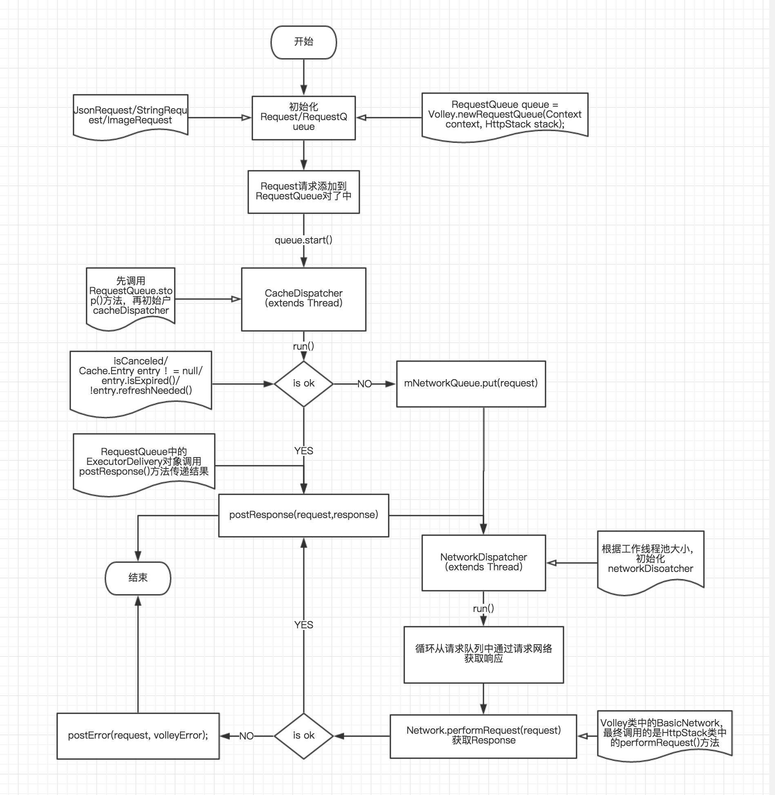
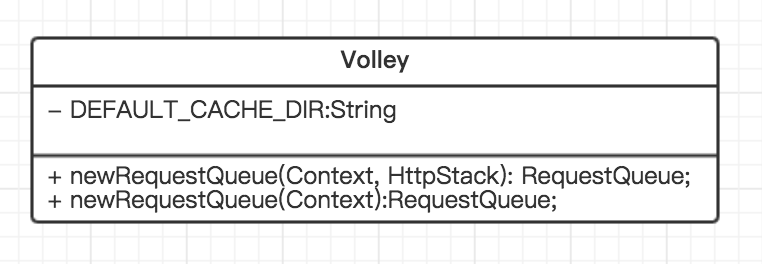
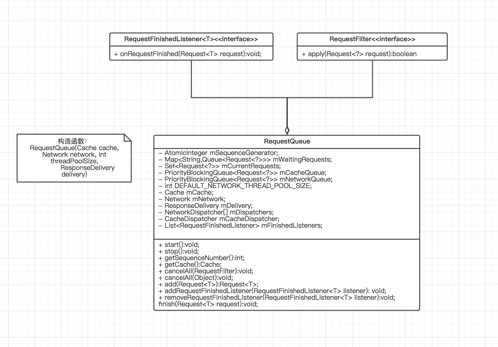
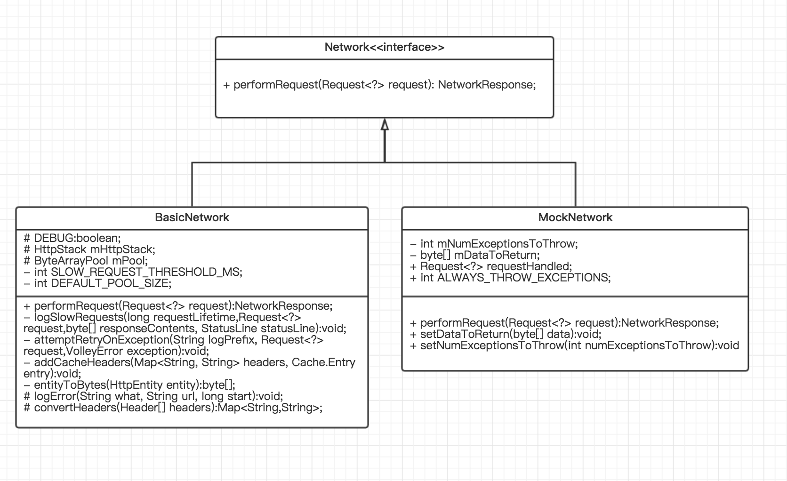
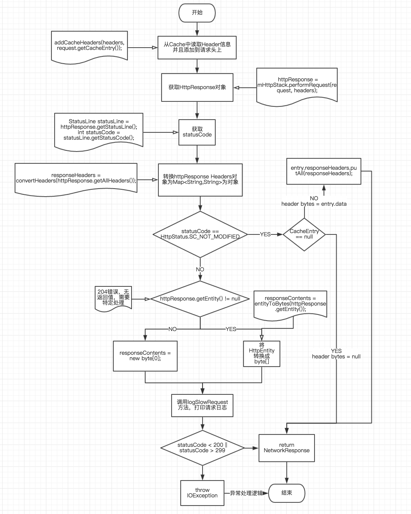
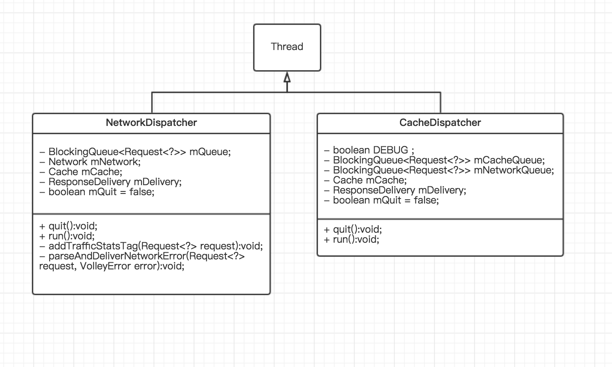
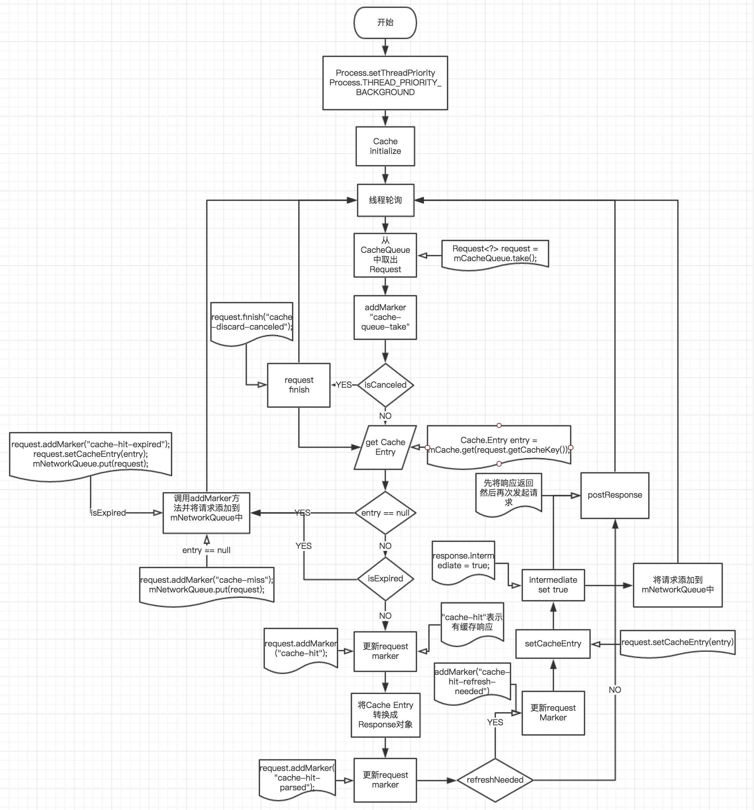
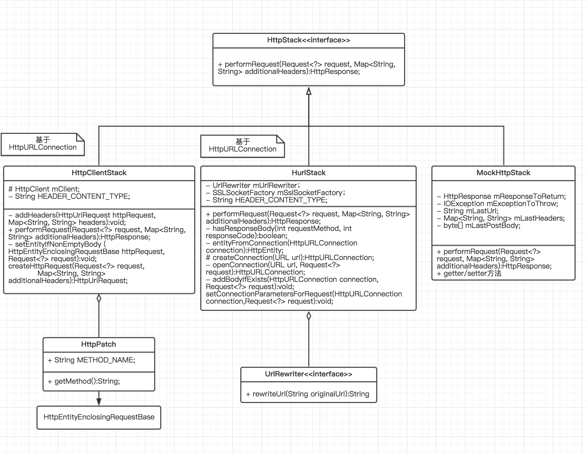

# Volley源码解析

## 目标
+ [X] 了解功能，学会用法
+ [ ] 了解框架设计核心思想及相关技术点  

## 阅读路径
1. 使用方式入手
2. 解析核心类
3.  掌握相关操作流程
4.  绘制类图和流程图
5.  从架构和设计思想方面分析
6.  详细解析某些功能点
 
### 使用方式
 + 建立请求队列
 + 创建请求，监听响应
 + 把请求加入队列
 
```java
 RequestQueue mQueue = Volley.newRequestQueue(conext);
 StringRequest stringRequest = new StringRequest(method,url,new Listener(){
 		@Override
 		public void onResponse(String response) {
 			Log.d("doJsonRequest:"+url,response);
 		}
 }, new ErrorListener(){
 		 @Override
 		 public void onErrorResponse(VolleyError error) {
 		 	Log.e("doJsonRequest","error:",error);
 		 }
 })；
```

### 核心类
+ Volley类 
+ RequestQueue类
+ Request类
	+ StringRequest
	+ JsonRequest
		+ JsonObjectRequest
		+ JsonArrayRequest
	+ ImageRequest
+ Response类
+ ResponseDelivery类
	+ ExecutorDelivery
		+ ImmediateResponseDelivery
	+ MockResponseDelivery  
+ Network类
	+ BasicNetwork
	+ MockNetwork
+ HttpStack类
	+ HttpClientStack
	+ HurlStack
	+ MockHttpStack  
 
## 流程图

## 详细解析
+ Volley类解析
	+ 类图说明

	+ 核心类
		+ RequestQueue
		+ Network
		+ HurlStack
		+ HttpClientStack
		+ DiskBasedCache 
	+ 核心方法／属性 
		+ 核心属性
			+ DEFAULT_CACHE_DIR：`磁盘缓存默认文件夹`
		+ 核心方法
			+ newRequestQueue(Context,HttpStack)->RequestQueue
				+ 创建默认RequestQueue工作池/缓存目录
				+ 决定底层Network方式：`Android 2.3及其以上采用HurlStack方式通信——HttpURLConnection，以下采用HttpClientStack方式通信——HttpClient`
				
					```java
					// 此处可以通过自定义HttpStack决定，底层http客户端通信方式——volley+okhttp
					if (stack == null) {
						if (Build.VERSION.SDK_INT >= 9) {
							// HttpClient
							stack = new HurlStack();
						} else{
							// HttpUrlConnection
							stack = new HttpClientStack(AndroidHttpClient.newInstance(userAgent));
						}
					}
					Network network = new BasicNetwork(stack);
					RequestQueue queue = new RequestQueue(new DiskBasedCache(cacheDir), network);
					queue.start();
					```
	
	+ RequestQueue类解析
		+ 类图说明

		
		+ 核心属性／方法说明
			+ DEFAULT_ NETWORK _ THREAD _ POOL _ SIZE：网络请求线程池大小，默认值为4
			+ 两种处理机制
				+ Cache：缓存机制
					+ Cache cache：通过缓存文件处理响应
					+ PriorityBlockingQueue<Request<?>> mCacheQueue 
					+ CacheDispatcher mCacheDispatcher
				+ Network
					+ Network mNetwork：通过请求网络处理响应
					+ PriorityBlockingQueue<Request<?>> mNetworkQueue 
					+ NetworkDispatcher[] mDispatchers
			+ start()方法：启动队列中的dispatchers[dispatcher会调用start方法]
			
			```java
			public void start() {
				stop();  // Make sure any currently running dispatchers are stopped.
				// Create the cache dispatcher and start it.
				mCacheDispatcher = new CacheDispatcher(mCacheQueue, mNetworkQueue, mCache, mDelivery);
				mCacheDispatcher.start();
				// Create network dispatchers (and corresponding threads) up to the pool size.
				// mDispatchers  = new NetworkDispatcher[threadPoolSize];
        		for (int i = 0; i < mDispatchers.length; i++) {
        			NetworkDispatcher networkDispatcher = new NetworkDispatcher(mNetworkQueue, mNetwork,mCache, mDelivery);
        			mDispatchers[i] = networkDispatcher;
        			networkDispatcher.start();
        		}
    		}
			``` 
		
			+ stop()方法：关闭cache和network dispatchers[会调用dispatcher的quit方法]
			+ add()方法：把请求加入请求队列
			
			```java
			public <T> Request<T> add(Request<T> request) {
				// Tag the request as belonging to this queue and add it to the set of current requests.
				request.setRequestQueue(this);
				synchronized (mCurrentRequests) {
					mCurrentRequests.add(request);
				}
				// Process requests in the order they are added.
				request.setSequence(getSequenceNumber());
				request.addMarker("add-to-queue");
				// If the request is uncacheable, skip the cache queue and go straight to the network.
				if (!request.shouldCache()) {
					mNetworkQueue.add(request);
					return request;
				}
				// Insert request into stage if there's already a request with the same cache key in flight.
				synchronized (mWaitingRequests) {
					String cacheKey = request.getCacheKey();
					if (mWaitingRequests.containsKey(cacheKey)) {
						// There is already a request in flight. Queue up.
						Queue<Request<?>> stagedRequests = mWaitingRequests.get(cacheKey);
						if (stagedRequests == null) {
							stagedRequests = new LinkedList<Request<?>>();
						}
						stagedRequests.add(request);
						mWaitingRequests.put(cacheKey, stagedRequests);
						if (VolleyLog.DEBUG) {
							VolleyLog.v("Request for cacheKey=%s is in flight, putting on hold.", cacheKey);
						}
					} else {
						// Insert 'null' queue for this cacheKey, indicating there is now a request in flight.
						mWaitingRequests.put(cacheKey, null);
						mCacheQueue.add(request);
					}
					return request;
				}
			}
			```
		+ finish()方法：mCurrentRequests／mWaitingRequests移除已经执行完成的请求，添加的监听器—RequestFinishedListener调用onRequestFinished方法进行通知
		+ 相关类
			+ CacheDispatcher
			+ NetworkDispatcher 
			+ Cache
			+ Request
			+ ResponseDelivery
	+ Network类解析
		+ 类图说明
 
		+ 核心属性／方法说明
			+ performRequest(Request<?> request)：`执行请求方法，返回NetworkResponse`
		+ 实现类
			+ BasicNetwork类解析：`处理Http网络请求类`
				+  核心属性／方法说明
					+ 核心属性  
						+ DEFAULT_POOL_SIZE：`默认缓存池大小，默认值为4096 byte`	  
						+ SLOW_REQUEST_THRESHOLD_MS：`网络请求日志打印的间隔时间，默认3000 ms`
						+ HttpStack mHttpStack：`Volley类带过来的HttpStack client，最终执行网络请求的类`
						+ ByteArrayPool mPool：缓存池大小
					+ 核心方法
						+ performRequest(Request<?> request)：`返回值NetworkResponse，HttpStack执行performRequest()方法获取HttpResponse,再将HttpResponse封装成NetworkResponse对象进行返回，或者调用重试方法进行重试，或者返回异常`
							+ 流程图

						
						+ addCacheHeaders(Map<String, String> headers, Cache.Entry entry)：`添加[If-None-Match/If-Modified-Since]字段到请求头`
						+  convertHeaders(Header[] headers)：`返回值为Map<String,String>类型，把响应头信息转换成Map<String,String>`
						+  entityToBytes(HttpEntity entity)：`放回值byte[]，将HttpEntity 转换成byte[]`
						+  logSlowRequests(long requestLifetime, Request<?> request,byte[] responseContents, StatusLine statusLine)：`打印请求信息`
						+  attemptRetryOnException(String logPrefix, Request<?> request,VolleyError exception)：`尝试重试请求——request.addMarker，performRequest()方法一直轮询，如果不返回或者异常则会一直请求`
							+ BasicNetwork异常处理机制流程图
  
			+ MockNetwork类解析：`用于Http网络请求测试类` 
	+ Dispatcher机制
		+ 类图说明
 
		+ 实现类
			+ NetworkDispatcher类解析
				+ 核心属性／方法说明 
			+ CacheDispatcher类解析
				+ 类说明：`处理响应请求缓存类，Thread子类，在RequestQueue类中的start()方法中调用CacheDispatcher的start()方法执行轮询操作` 
				+ 核心属性／方法说明 
					+ 核心属性
						+ BlockingQueue<Request<?>> mCacheQueue：`请求的缓存队列`
						+ BlockingQueue<Request<?>> mNetworkQueue：`网络请求队列，和NetworkDispatcher共享，RequestQueue类中start()方法传入` 
						+ Cache mCache：`用于写入和读取缓存的类`
						+ ResponseDelivery mDelivery：`用于处理响应的类`
						+ boolean mQuit：`判断是否结束的标志，默认值false`
					+  核心方法
						+ quit()：`结束缓存，mQuit=true同时调用Thread.interrupt()方法退出线程`
						+ run()：`处理请求，读取缓存，写入缓存`
							+ 流程图 

	+ HttpStack类解析
		+ 类图说明

		+ 核心属性／方法说明
		+ 实现类 
			+ HurlStack类解析
			+ HttpClientStack类解析 
			+ MockHttpStack类解析
		
## 深入解析
+ Volley范型机制
+ HttpClient/HttpURLConnection封装技巧
+ Response消息传递机制
+ Cache机制
